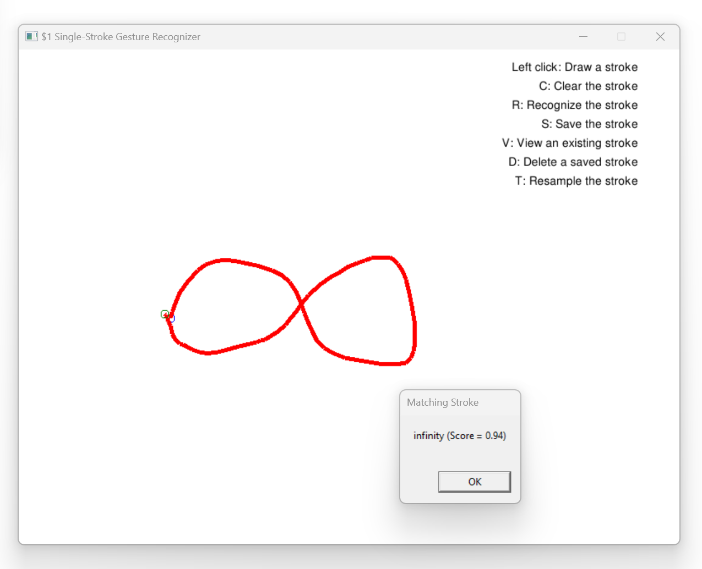
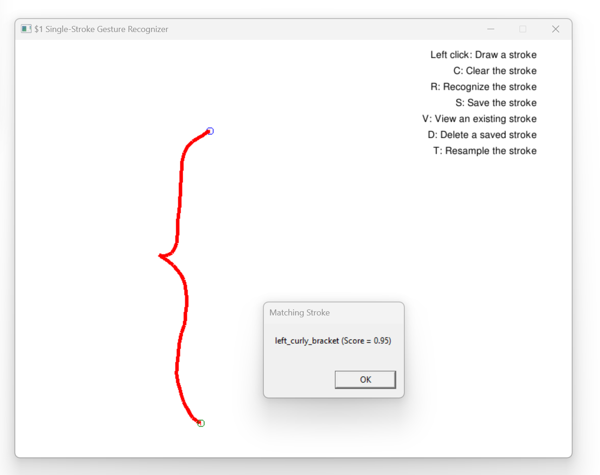
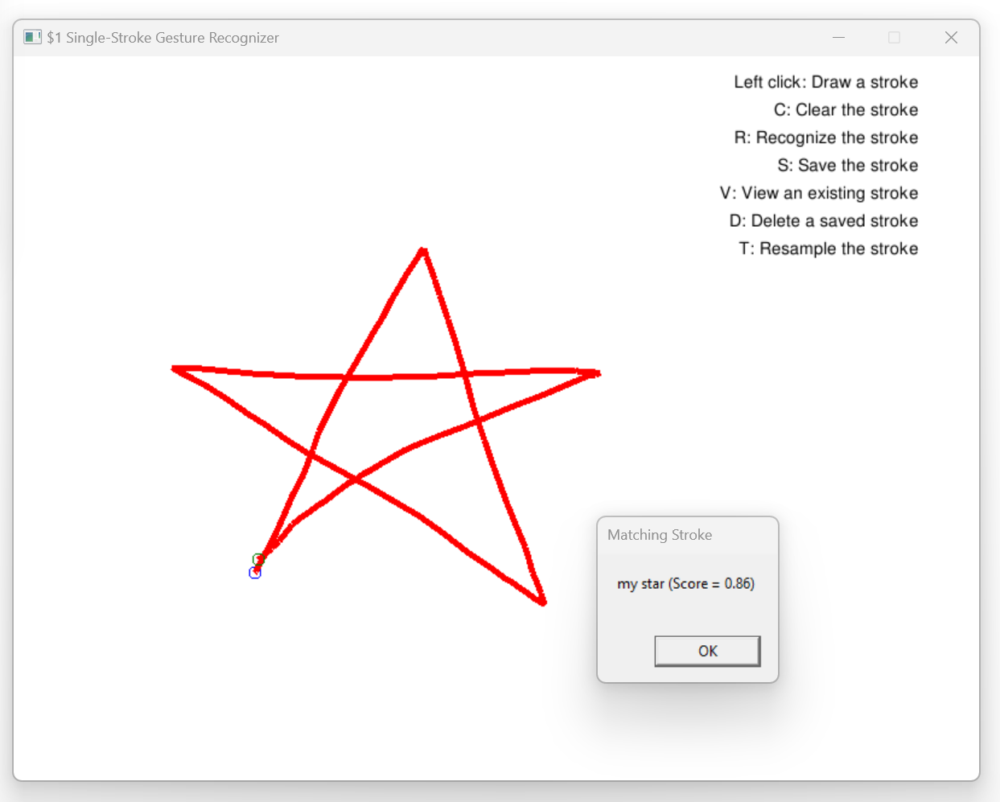

# Unistroke Gesture Recognizer
Project: $1 Single-Stroke Gesture Recognizer  
Programmer: Khoi Ho  

Description: 
This project aims to implement the single-stroke gesture recognition algorithm created by Washington University.  
Link to the research paper and the pseudocode: https://depts.washington.edu/acelab/proj/dollar/  

Features:
+ Draws single strokes on screen.
+ Recognizes which template matches the drawn stroke.
+ Saves the drawn stroke as a new template.
+ Views an existing template.
+ Resamples and displays the drawn stroke to help the user visualizes the result of the resampling algorithm.

How to control:
+ Left mouse button: Hold to draw a stroke, release to stop drawing. Note that the previous stroke is deleted when you draw a new one.
+ C: Clear the drawn stroke.
+ R: Recognize the stroke.
+ S: Save the stroke as a template.
+ V: View an existing template.
+ D: Delete a saved template.
+ T: Resample the drawn stroke.

Format of mystrokes.txt:  
The first line is the number of template strokes.  
For each template, the first line is the name of the template, the second line is the number of points n, and the subsequent n lines contain the coordinates of the points.

